# 👋 Hello friend, I'm Marcos Tolosa (aka Tr0p)

I'm a red teamer, pentester, bug bounty hunter, reverse engineer and I really like automating the boring part. My brain is wired differently (ASD Level 1), giving me the hyperfocus needed to dismantle complex threats and then teach others how they tick. I don't just find vulnerabilities; I tear them apart to understand their core.

- I don't just hack; I teach what I learn: Offensive techniques, binary reversing, and application security, etc - from the attacker's perspective.
- Always hunting: When I'm not on an engagement, you'll find me owning boxes on HTB, THM, researching with BugCrowd, HackerOne, Intigritti and learning more from pwn.college, malops and pretty much any other platform worth its salt (Crackmes.one, MalwareBazaar, DEFCON, etc.).

### 🛡️ Vulnerability Research & Disclosures
- **[CVE-2025-10230 (CVSS 10.0)](https://aisle.com/blog/CVE-2025-10230-the-cvss-100-vulnerability-that-hid-in-samba-for-13-years)**: Discovered a critical OS Command Injection vulnerability in Samba hidden for 13 years.
- **[CVE-2025-67503 (CVSS 8.2)](https://github.com/LabRedesCefetRJ/WeGIA/security/advisories/GHSA-r9mh-4hc4-h2p3)**: Discovered a high Cross-Site Scripting (XSS) Reflected vulnerability in WeGIA platform.
- **[Unauthenticated OS Command Injection](https://bugcrowd.com/engagements/ncua-vdp/crowdstream)**: Dicovered a P1 Unauthenticated OS Command Injection in U.S. Gov. (NCUA).
- **[Samba CTDB](https://gitlab.com/samba-team/samba/-/merge_requests/4240/diffs?commit_id=caa2ac41bf25c524cbe5079a450d87f30a25b0a2)**: Reported a Buffer Overflow vulnerability in the InfiniBand wrapper due to unsafe string handling.
  
## 🌐 Socials:
      

---

# 💻 Tech Stack:
            

### 🧠 My Playground

- Red Teaming & APT Emulation
- Exploit Development & Reverse Engineering
- AI/ML in Offensive Security
  -  Authored Tools: ARCTAX, MANW-NG, riskIA-service, OSCP Insights, REload.Me, etc.
- Advanced AppSec & DevSecOps
- Cloud Security & Secure Architecture

- My Go-To Stack:
  - Heavy Hitters: BurpSuite Pro, pwntools, Frida, Radare2/Rizin, Ghidra, IDA Pro, x64/x32dbg, Impacket, ffuf, naabu/nuclei, Nmap, CrackMapExec, BloodHound, tshark, Havoc, Cobalt Strike, mitmproxy.
  - Languages of Choice: Python for everything, Bash and PowerShell for speed, C/C++ when I need to get close to the metal and JavaScript to run everywhere.
  - Techniques: If it can be scripted, I automate it. Advanced Regex, Semgrep, CodeQL, and custom scripts are part of my workflow.

 

<!-- Snake Animation Agrandie et Fonctionnelle -->

  

---

    

  

