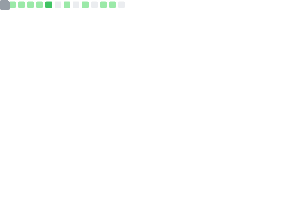

<div align="center">


<br>

[](https://github.com/marcostolosa)
[](https://github.com/marcostolosa)


</div>

---

## `> whoami`

```c
Red teamer, pentester, bug bounty hunter and reverse engineer.
I don't just find vulns - I tear them apart to understand their core,
then automate the boring part and teach how they tick.

Wired differently (ASD Lvl 1) → the hyperfocus that dismantles complex
threats and turns them into writeups anyone can follow.
```

- 🔩 **Break → Understand → Automate → Teach.** Offensive technique, binary reversing and AppSec, always from the attacker's seat.
- 🎯 **Always hunting.** HTB / THM boxes, research on **Bugcrowd · HackerOne · Intigriti · YesWeHack**, sharpening on pwn.college, Crackmes.one, MalwareBazaar & DEFCON.
- 🧪 **Real environments only.** Isolated labs, working PoCs, detailed exploits - logs on the console, concrete proof, zero bullshit.

---

## `> disclosures --list` 🛡️

Real findings, real impact. The ledger:

| CVE / ID | Target | Class | Severity |
|---|---|---|---|
| **[CVE-2025-10230](https://aisle.com/blog/cve-2025-10230-the-cvss-100-vulnerability-that-hid-in-samba-for-13-years)** | Samba | OS Command Injection *(13 yrs hidden)* | `CVSS 10.0` 🔴 |
| **[CVE-2026-23722](https://github.com/LabRedesCefetRJ/WeGIA/security/advisories/GHSA-g7hh-6qj7-mcqf)** | WeGIA | Stored XSS → RCE / UI redressing | `CVSS 9.1` 🔴 |
| **[CVE-2025-67503](https://github.com/LabRedesCefetRJ/WeGIA/security/advisories/GHSA-r9mh-4hc4-h2p3)** | WeGIA | Reflected XSS | `CVSS 8.2` 🟠 |
| **[NCUA VDP](https://bugcrowd.com/engagements/ncua-vdp/crowdstream)** | 🇺🇸 U.S. Gov | Unauthenticated OS Command Injection | `P1` 🔴 |
| **[Digital Flanders](https://yeswehack.com/programs/digital-flanders-vulnerability-disclosure-program#program-activity)** | 🇧🇪 Belgium Gov | Blind XXE → Internal SSRF *(Tomcat Manager)* | `High` 🟠 |
| **[Samba CTDB](https://gitlab.com/samba-team/samba/-/merge_requests/4240/diffs?commit_id=caa2ac41bf25c524cbe5079a450d87f30a25b0a2)** | Samba | Buffer Overflow *(InfiniBand wrapper)* | `Memory Corruption` 🟠 |

---

## `> cat arsenal.txt` ⚙️

```bash
[recon]        nmap · naabu · nuclei · ffuf · amass · httpx · subfinder
[exploitation] Burp Suite Pro · pwntools · Metasploit · sqlmap · mitmproxy
[reversing]    IDA Pro · Ghidra · Radare2/Rizin · x64dbg · Frida · gdb-pwndbg
[ad / redteam] BloodHound · Impacket · CrackMapExec · Certipy · Rubeus · Havoc · Cobalt Strike
[cloud]        AWS · Azure · GCP · Terraform · Docker · Kubernetes
[analysis]     Semgrep · CodeQL · advanced regex · custom tooling
```

<div align="center">

**Languages of choice**


*Python for everything · Bash & PowerShell for speed · C when I need to get close to the metal · JS to run everywhere. If it can be scripted, I automate it.*

</div>

---

## `> ls ~/playground` 🧠

`Red Teaming & APT Emulation` &nbsp;•&nbsp; `Exploit Dev & Reverse Engineering` &nbsp;•&nbsp; `Malware Analysis` &nbsp;•&nbsp; `AI/ML in Offensive Security` &nbsp;•&nbsp; `Advanced AppSec & DevSecOps` &nbsp;•&nbsp; `Cloud Security & Secure Architecture`

---

## `> git log --stat` 📊

<div align="center">


<br>


<p align="center" width="100%">
  <a href="https://github.com/marcostolosa">
    
  </a>
</p>

<div align="center">
  
</div>


</div>

---

## `> nc -connect` 📡

<div align="center">

[](https://www.linkedin.com/in/marcos-tolosa/)
[](https://twitter.com/MarcosTolosa_)
[](https://discord.gg/T9RVG3re2J)
[](https://youtube.com/@Marcos.Tolosa)
[](mailto:marcos.tolosa@owasp.org)

</div>


<div align="center">
<br>
<sub><code>PS C:\Users\Tr0p> exit &nbsp;# thanks for reading... now go own something! (with authorization).</code></sub>
</div>

